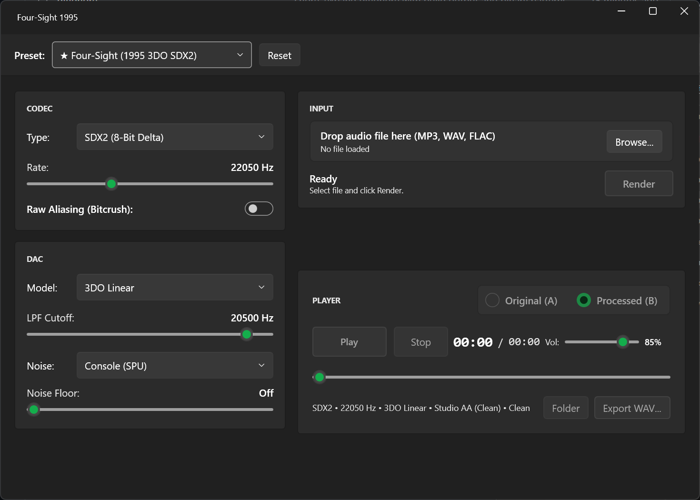

# OldSound



Audio processing tool for reproducing authentic digital compression and hardware signal paths of mid-1990s consoles (3DO, PS1) and compact cassette tape.

Unlike generic bitcrushers, OldSound models the exact historical compression and reconstruction algorithms:
- **3DO Opera (Four-Sight 1995)**: 8-bit non-linear square-root delta codec (SDX2) with transient slew-rate limiting, 129-tap Blackman-Harris FIR anti-aliasing pre-filter at 10.5 kHz, `half_rate.dsp` microcode (linear upsampling generating mirror imaging in 11–22 kHz), and 20.5 kHz Sallen-Key reconstruction DAC filter.
- **Sony PlayStation (1994 SPU)**: 4-bit ADPCM (VAG) with 5 autoregressive prediction filters, hardware 4-point Gaussian interpolation, and 3-pole analog reconstruction filter at 12 kHz.
- **Compact Cassette (Type I)**: Non-linear magnetic tape saturation, wow & flutter, high-frequency roll-off, and analog hiss.

## Building and Running

Requires .NET 10 SDK for building from source. The GUI embeds a compressed FFmpeg binary and has no external dependencies.

```bash
# Run test suite
dotnet test

# Publish self-contained single-file executable
dotnet publish src/OldSound.Gui/OldSound.Gui.csproj -c Release -r win-x64 --self-contained -p:PublishSingleFile=true -o dist
```

Standalone binary: `dist/OldSound.Gui.exe`.

## Features

- Headroom safety: Automatic peak limiting (-1.4 dBFS headroom) preventing digital clipping.
- Instant A/B comparison: Seamless toggle between Original and Processed audio.
- Raw Aliasing mode: Toggleable anti-aliasing filter to compare clean 3DO reproduction against raw decimation crunch.
- Supported audio formats: WAV, MP3, FLAC, OGG, AIFF (export presets: MP3 320 kbps, FLAC lossless, 16-bit WAV PCM).
